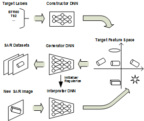
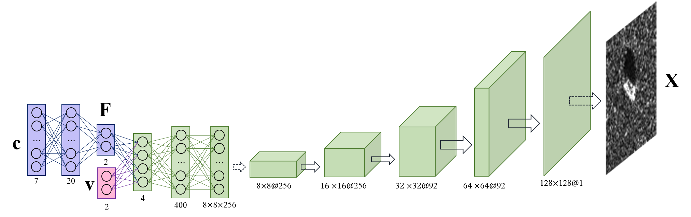
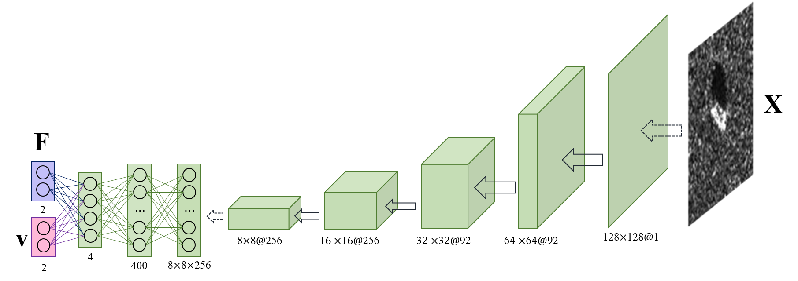
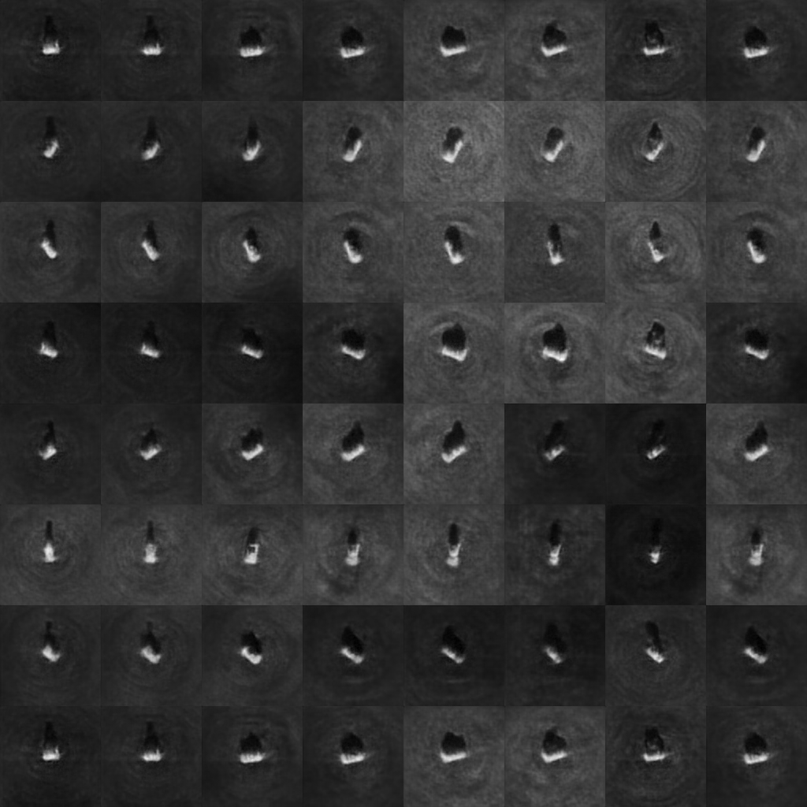

# SAR-ZSL_for_featureSpace
Code for paper "Zero-Shot Learning of SAR Target Feature Space With  Deep Generative Neural Networks"

### Overall framework of the generative DNN-based SAR target feature space construction and interpretation:

### Constructor–generator network for MSTAR data:

### Inverse interpreter DNN for MSTAR data:

## Prerequisites
- [Python 2.7](https://www.python.org/)
- [Tensorflow](https://www.tensorflow.org/)
- [Scipy](http://www.scipy.org/install.html)
- [Numpy](http://www.numpy.org/)

## Useage
First download the data and save as *.mat* format

to pre-train the constructor NN:
`$ python preTrain.py`

to train constructor–generator network:
`$ python train.py`

to train or inferece interpreter DNN:
`$ python classification.py`

## Results
### Generated full-aspect SAR images:

## Authors
- [Qian Song](https://github.com/QianSong-Cherry/)
- [Feng Xu](https://github.com/fudanxu/)

## References
[1] Q. Song and F. Xu, "Zero-Shot Learning of SAR Target Feature Space With  Deep Generative Neural Networks," IEEE GRSL, vol. 14, no. 12, 2017.

[2] A. Dosovitskiy et al., "Learning to Generate Chairs, Tables and Cars with Convolutional Networks," arXiv:1411.5928v3.
